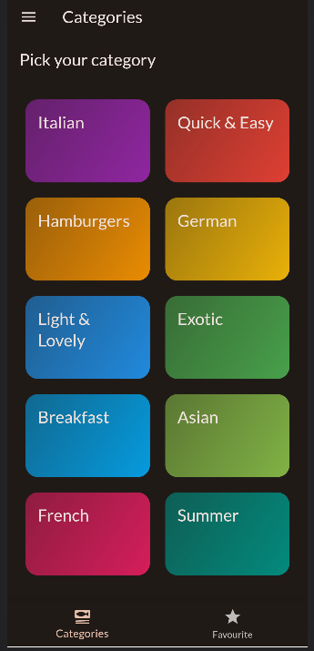
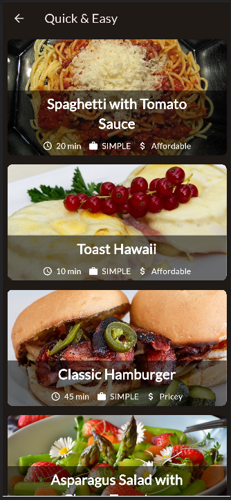
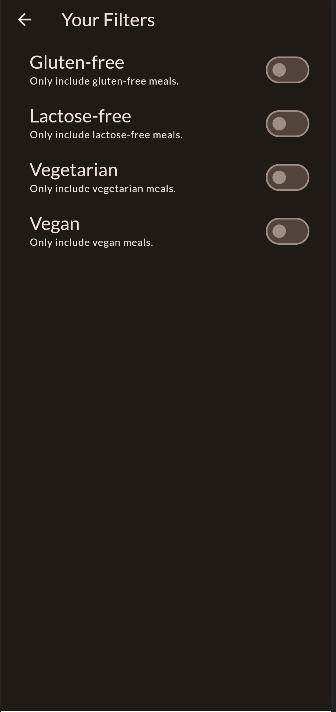
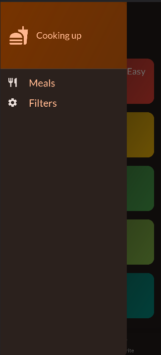
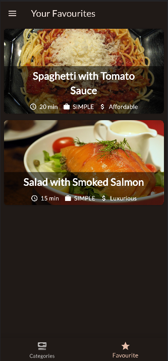
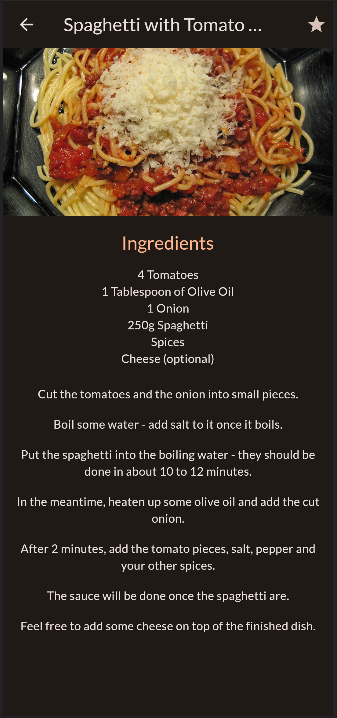

# Meals

A Flutter project that displays a list of meals.

## Getting Started

To get started, clone this repository and run the following commands:
flutter pub get
flutter run

This will start the app in your emulator or simulator.

## Features

The app displays a list of meals. Each meal has a name, an image, and a list of ingredients.

- Navigations
- Bottom Navigation Bar
- Gridview
- Animation
- ListViewBuilder
- State Management using Riverpod

## Usage

To use the app, simply tap on a meal to view its details.

## Development

The app is developed using Flutter. The code is well-organized and commented.

| Categories Screen                   | Meals Screen                  |
| ----------------------------------- | ----------------------------- |
|  |  |

| Filter Screen                  | App Drawer                  |
| ------------------------------ | --------------------------- |
|  |  |

| Favourites Screen                 | Meal Detail Screen                    |
| --------------------------------- | ------------------------------------- |
|  |  |
